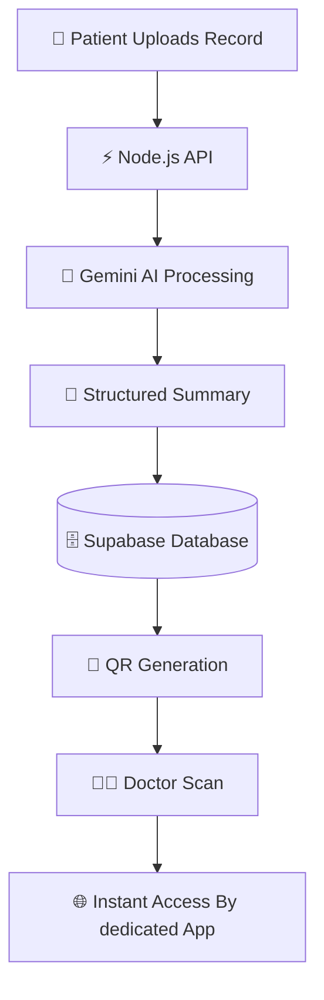

<div align="center">

# 🩺 MEDORA
### *AI-Powered Secure Health Records Ecosystem*


<br>


</div>

---

# 🚨 The Healthcare Problem Nobody Solved Properly

Every year, millions of Indian patients:

- Lose medical reports
- Forget prescriptions
- Carry huge physical files
- Repeat expensive tests
- Explain the same history repeatedly

Meanwhile doctors waste:

⏳ **5–10 minutes per patient** collecting medical history manually.

This creates:

- ❌ Delayed treatment
- ❌ Incorrect diagnosis risks
- ❌ Duplicate medical expenses
- ❌ Fragmented healthcare data
- ❌ Poor emergency response

---

# ⚡ What is Medora?

> Medora is a secure AI-powered healthcare infrastructure platform that makes medical records portable, intelligent, and instantly shareable using QR technology.

Instead of carrying files...

Patients simply share **ONE secure QR code**.

Doctors instantly access:
- AI summaries
- Previous reports
- Medications
- Allergies
- Longitudinal medical history

Without installing any app.

---

# 🧠 Core Features

<table>
<tr>
<td width="50%">

## 🤖 AI Medical Summaries
Gemini AI converts lengthy reports into:
- Key Findings
- Medications
- Allergies
- Important Risks
- Simplified Insights

</td>

<td width="50%">

## 🔐 Secure QR Sharing
Generate encrypted, expiring QR codes for:
- Instant doctor access
- Read-only sessions
- Secure healthcare sharing

</td>
</tr>

<tr>
<td width="50%">

## 📂 Smart Record Organization
Organize reports into:
- Blood Tests
- Prescriptions
- Scans
- Radiology
- Cardiology

</td>

<td width="50%">

## 📈 Longitudinal Health Tracking
Track patient health patterns over time using AI-powered insights.

</td>
</tr>
</table>

---

# 🏗️ Architecture Overview



---

# 🔒 Security Architecture

```diff
+ AES-256 Encryption
+ JWT Authentication
+ Role-Based Access Control
+ Time-Limited QR Tokens
+ Audit Logging
+ Secure Cloud Storage
+ User Controlled Deletion
```

---

# 🛠️ Tech Stack

<div align="center">

| Technology | Purpose |
|---|---|
| ⚛️ React Native Expo | Cross-platform mobile app |
| 🟢 Node.js + Express | Backend APIs |
| 🧠 Gemini 2.5 Flash | AI Summarization |
| 🗄️ Supabase PostgreSQL | Database |
| ☁️ Supabase Storage | Secure File Storage |
| 🔐 JWT + Supabase Auth | Authentication |
| 🚀 Render / Vercel | Deployment |

</div>

---

# 📱 How It Works

## 👤 Patient Flow

```text
Upload Report
      ↓
AI Generates Summary
      ↓
Generate Secure QR
      ↓
Share with Doctor
```

---

## 👨‍⚕️ Doctor Flow

```text
Scan QR
    ↓
View AI Summary
    ↓
Access Medical History
    ↓
Treat Faster
```

---

# 🎯 Real Impact

| Before Medora | After Medora |
|---|---|
| Carrying physical files | Digital records |
| 5–10 mins history collection | <30 seconds |
| Missing reports | Unified history |
| Repeat tests | Smarter treatment |
| Fragmented healthcare | Connected healthcare |

---

# 🚀 Why Medora is Different

Most healthcare apps focus on:
- Appointments
- Billing
- Hospital management

Medora focuses on the **actual patient problem**:

> Portable medical history.

## Our Moat

```yaml
Workflow Integration:
  Hospitals upload records directly

Distribution Flywheel:
  Clinics → Patients → Doctors → More Clinics

AI Layer:
  Structured healthcare intelligence

Zero Friction:
  No doctor app installation required
```

# 🔮 Future Vision

- 🧠 AI Health Assistant
- 🚑 Emergency Mode
- 🎙️ Voice-Based Report Explanation
- 🌐 ABDM Integration
- 📈 Predictive Health Insights
- 🌍 Multi-language AI Summaries

---

# 🧬 Vision Statement

<div align="center">

# “Healthcare records should move with the patient — not stay trapped inside hospitals.”

</div>

---

# ⭐ Support The Project
